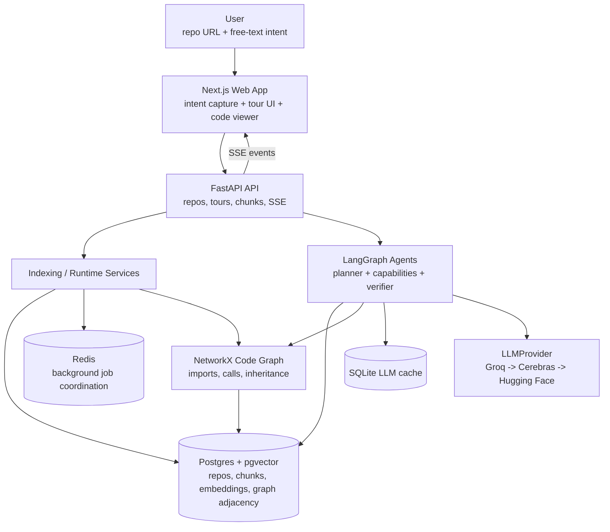
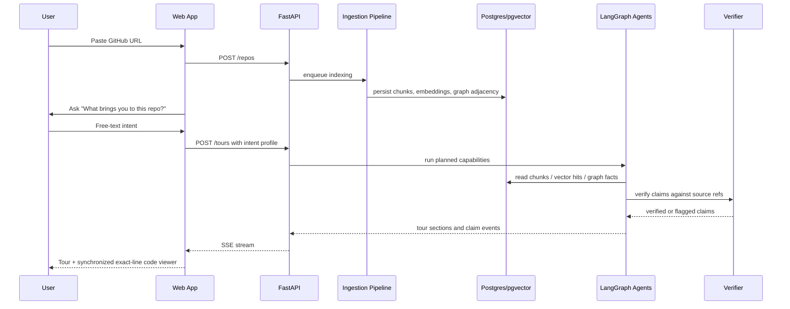
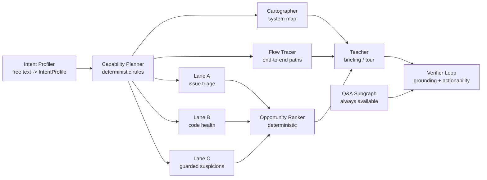
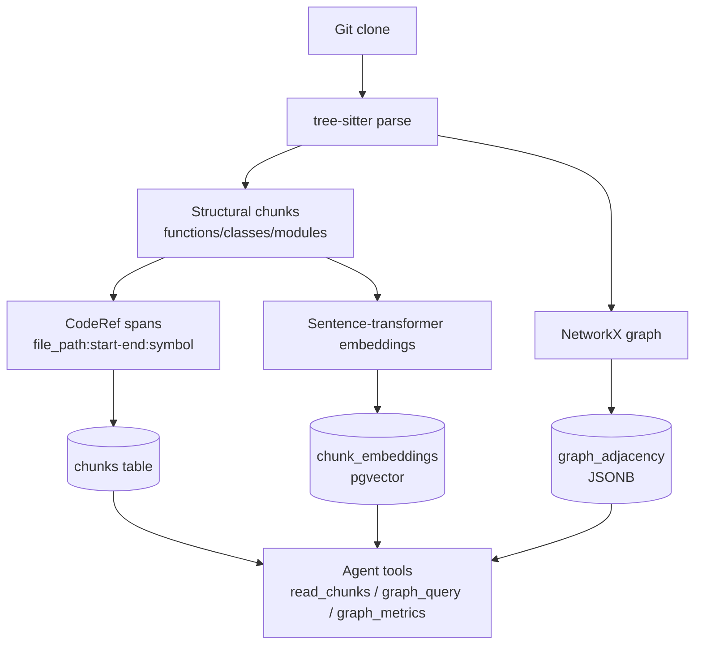
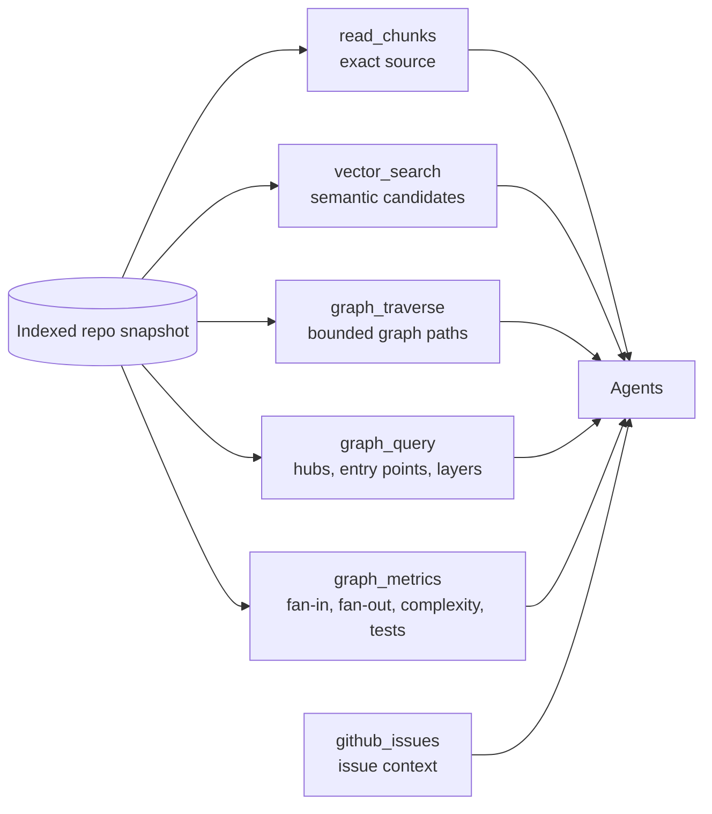

# RepoPilot

RepoPilot is a purpose-driven codebase onboarding tool for public Python repositories. A user pastes a GitHub URL, explains what they are trying to do, and gets a grounded tour of the codebase where every factual claim is tied back to concrete `file:line` references.

The project is built around one bet: the system should ask *why you are here* before it analyzes the repo. A learner, a first-time contributor, and a security-minded reviewer should not receive the same tour.

> Current status: the RAG closeout is shipped on `main` and the project is ready for local beta/demo use. Start with the [local startup guide](docs/STARTUP_GUIDE.md). Historical phase and eval notes are archived under [docs/](docs/).

## What It Does

RepoPilot turns a repository into a purpose-aware map:

- Clones and indexes a public Python GitHub repository.
- Parses Python with tree-sitter and builds a deterministic code graph with NetworkX.
- Chunks source at structural boundaries and stores exact source spans in Postgres.
- Embeds chunks into pgvector for semantic retrieval.
- Captures the user's free-text intent and converts it into an `IntentProfile`.
- Plans which agent capabilities should run using deterministic planner rules.
- Generates guided tours, Q&A answers, and contribute-mode opportunities.
- Verifies factual claims against retrieved source before showing them.
- Streams results through a FastAPI SSE API into a Next.js synchronized code viewer.

RepoPilot is not a general chatbot over code. The LLM never invents the call graph; deterministic parsing and graph tools provide the facts, and generation is wrapped by a verifier.

## Current Build State

| Area | Status |
|---|---|
| Foundation | Monorepo, settings, LLM provider, lint/type/test tooling, Docker services |
| Ingestion | Clone → parse → chunk → graph → embed → persist |
| Q&A spine | Hybrid vector + graph retrieval with verifier loop |
| Orchestration | Intent profiler, deterministic capability planner, LangGraph state graph |
| Experience | FastAPI + Next.js product slice, SSE streams, code viewer scaffolding |
| Contribute mode | Lane A/B/C cores, ranker, and eval registration scaffold |
| Ship hardening | RAG ship report and retrieval eval artifact gate in CI |

The operational runbook lives in [docs/STARTUP_GUIDE.md](docs/STARTUP_GUIDE.md). Build history lives in [docs/CURRENT_PHASE.md](docs/CURRENT_PHASE.md), [docs/RAG_PLAN.md](docs/RAG_PLAN.md), and [docs/rag/](docs/rag/).

## Architecture At A Glance



## Runtime Flow



## Agent Graph

The agent system uses one shared `ArchaeologistState`. The generic intent layer always runs first; the capability planner then activates whichever capabilities match the user's stated intent.



### Graph Connections That Matter

RepoPilot has two important graph layers:

1. The **code graph** built from the target repository.
2. The **Graphify knowledge graph** built over this RepoPilot repo itself.

The target-repo code graph powers product behavior:



The six deterministic tools are the boundary between facts and language:



The Graphify repo graph is for contributors and AI agents working on RepoPilot:

```bash
graphify query "how does the verifier connect to Q&A?"
graphify explain "Capability Planner"
graphify path "IntentProfile" "Opportunity Ranker"
```

Graphify artifacts live in [graphify-out/](graphify-out/). After major code or architecture changes, run:

```bash
graphify update .
```

## Repository Structure

```text
.
├── apps/
│   ├── api/                  # FastAPI app, route models, services, SSE
│   └── web/                  # Next.js 15 app and browser tests
├── packages/
│   ├── core/                 # settings, logging, LLMProvider, model bindings
│   ├── ingestion/            # clone, parse, chunk, graph, embed, persist
│   ├── agents/               # LangGraph state, tools, capabilities, verifier, contribute mode
│   └── evals/                # eval registry, datasets, runners, reports
├── infra/
│   └── postgres/             # pgvector init SQL
├── docs/                     # design source of truth and phase gates
├── graphify-out/             # committed knowledge graph over this repo
├── docker-compose.yml        # Postgres + pgvector, Redis
├── Makefile                  # common dev/test commands
└── pyproject.toml            # uv workspace + Python quality config
```

### Key Source Areas

| Path | Purpose |
|---|---|
| `packages/core/src/repopilot_core/settings.py` | Runtime configuration from `.env` |
| `packages/core/src/repopilot_core/llm/provider.py` | Provider fallback, caching, and 429 handling |
| `packages/ingestion/src/repopilot_ingestion/pipeline.py` | End-to-end indexing pipeline |
| `packages/agents/src/repopilot_agents/state.py` | Shared Pydantic state contract |
| `packages/agents/src/repopilot_agents/graph.py` | Main LangGraph wiring |
| `packages/agents/src/repopilot_agents/tools/` | Deterministic tool layer |
| `packages/agents/src/repopilot_agents/verifier/` | Grounding and actionability checks |
| `packages/agents/src/repopilot_agents/contribute/` | Contribute-mode Lane A/B/C and ranker scaffolding |
| `apps/api/src/repopilot_api/app.py` | FastAPI routes and SSE endpoints |
| `apps/web/src/components/repopilot-app.tsx` | Main web experience |

## API Surface

The API exposes:

| Method | Path | Purpose |
|---|---|---|
| `GET` | `/health` | Health check |
| `POST` | `/repos` | Enqueue repo indexing |
| `GET` | `/repos/{repo_id}/status` | Poll indexing/readiness state |
| `GET` | `/repos/{repo_id}/first-impression` | SSE first-impression stream |
| `POST` | `/tours` | Create a tour for a ready repo |
| `GET` | `/tours/{tour_id}/stream` | SSE tour stream |
| `POST` | `/tours/{tour_id}/ask` | Ask a grounded follow-up question |
| `GET` | `/chunks/{chunk_id}` | Fetch exact source for the code viewer |

In development, FastAPI docs are available at `http://127.0.0.1:8000/docs`.

## Setup Your Own Local Instance

Use the dedicated [local startup guide](docs/STARTUP_GUIDE.md). The short version is:

```bash
make setup
cp .env.example .env
make services
make dev
```

Open `http://127.0.0.1:3000`. `make dev` runs the backend at `http://127.0.0.1:8000` and the frontend at `http://127.0.0.1:3000`.

## Development Workflow

Common commands:

```bash
make install          # uv sync --all-packages --all-groups
make lint             # ruff check + format check
make fmt              # format and ruff --fix
make typecheck        # mypy packages apps
make test             # fast pytest lane
make ci               # lint + typecheck + coverage
make test-slow        # integration/slow tests, needs services and provider keys
make docker-down      # stop and remove local service volumes
```

When changing architecture or adding modules, refresh the committed Graphify graph:

```bash
graphify update .
git add graphify-out/graph.json graphify-out/manifest.json
```

## Design Principles

RepoPilot follows a few hard rules:

- **Truthful over fluent:** claims need `CodeRef` source spans.
- **No stat dumps:** metrics become actionable `Insight` objects with consequences.
- **Intent first:** every downstream capability reads the user's stated purpose.
- **Deterministic facts, LLM narration:** parsing, graph construction, retrieval, and metrics are tool-driven.
- **Verifier wrapped:** unsupported claims are flagged, not silently shipped.
- **No fixed purpose enum:** there is no `learn/contribute/audit` branch; planner rules read continuous intent weights and raw-text signals.

## Documentation Map

| File | Why read it |
|---|---|
| [CLAUDE.md](CLAUDE.md) | Project rules and contributor workflow |
| [docs/STARTUP_GUIDE.md](docs/STARTUP_GUIDE.md) | Local runbook: install, env, services, API, web, checks |
| [docs/CURRENT_PHASE.md](docs/CURRENT_PHASE.md) | Build closeout status and deferred eval notes |
| [docs/03_ARCHITECTURE.md](docs/03_ARCHITECTURE.md) | Agent topology, state, tools, verifier |
| [docs/EVAL_SYSTEM.md](docs/EVAL_SYSTEM.md) | Eval harness and regression-gate explanation |
| [docs/archive/](docs/archive/) | Product thesis and historical stack rationale |
| [docs/rag/](docs/rag/) | Historical RAG phase specs and ship-closeout notes |

## Known Limitations

- Python-only target repos for v1.
- Public GitHub repos only.
- Large live repo demos depend on external model/provider quotas.
- Query Understanding and Ingestion Enrichment are implemented/evaluated but deferred because their gates missed.
- Grounding quality is strong at the claim level but the all-or-nothing product bar still needs follow-up.
- Docker Compose is for local data services; the app dev flow runs API/web directly.

## License

Proprietary. See [pyproject.toml](pyproject.toml).
