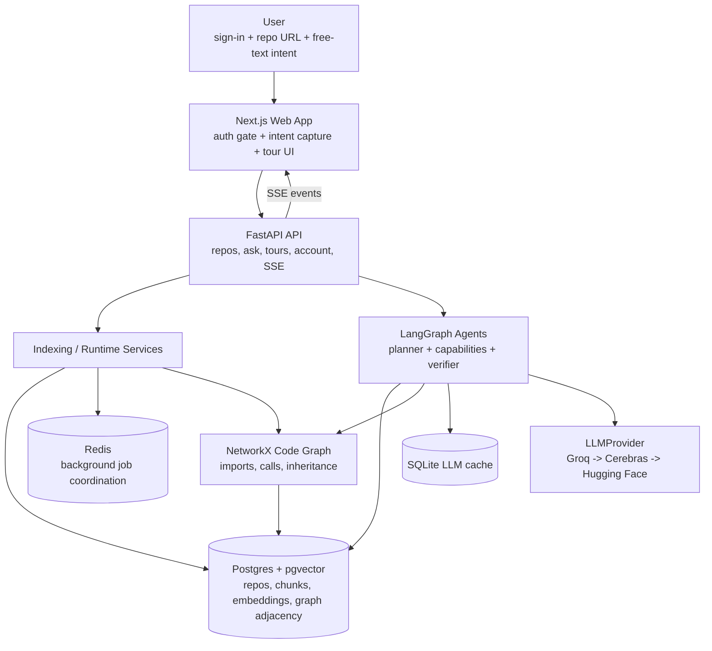
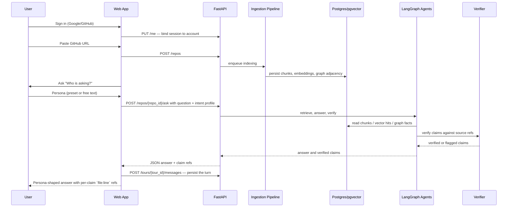
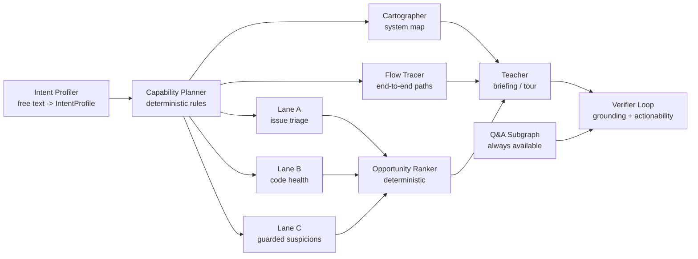
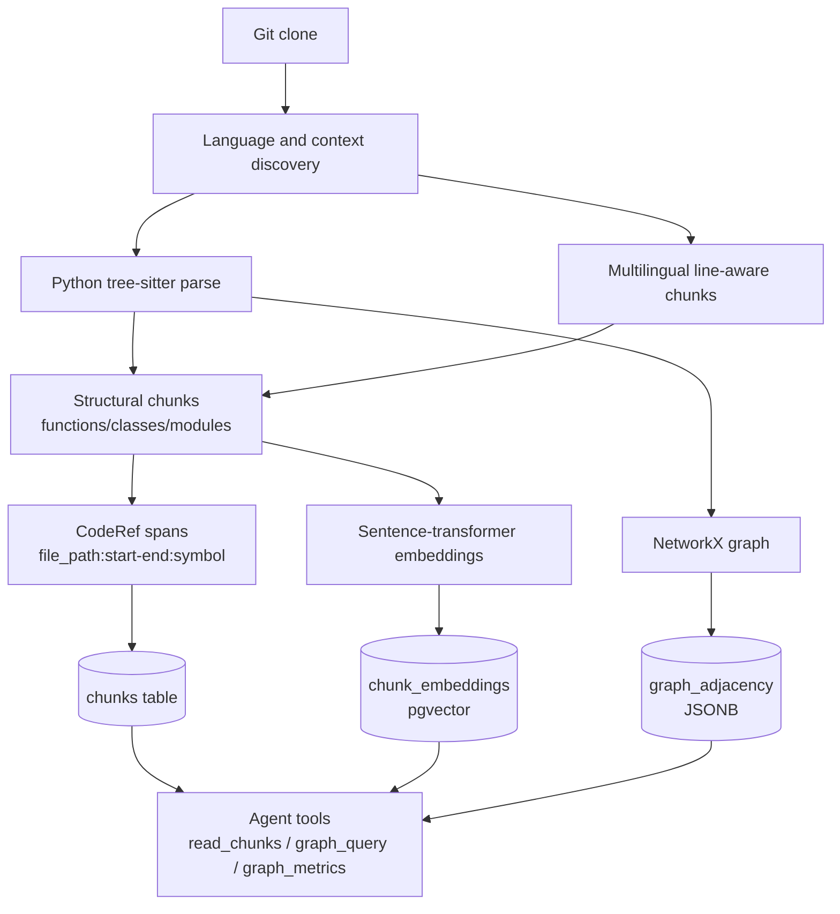
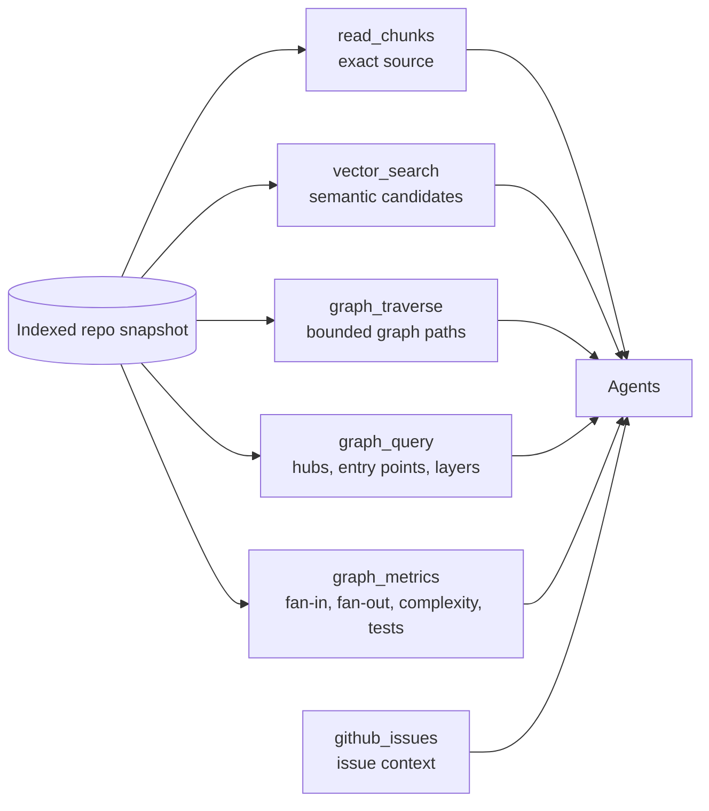

# RepoPilot

RepoPilot is a purpose-driven codebase onboarding tool for public software repositories. A user pastes a GitHub URL, explains what they are trying to do, and gets a grounded tour of the codebase where every factual claim is tied back to concrete `file:line` references. Python receives AST-level structural analysis; other supported languages receive line-aware retrieval chunks.

The project is built around one bet: the system should ask *why you are here* before it analyzes the repo. A learner, a first-time contributor, and a security-minded reviewer should not receive the same tour.

> Current status: launch-ready. Run it locally with the [startup guide](docs/STARTUP_GUIDE.md); deploy it with the [deployment guide](docs/DEPLOYMENT.md). Where the project stands day to day is in [docs/STATUS.md](docs/STATUS.md).

> **Deploy privately, not publicly.** RepoPilot has no rate limit and no spend
> ceiling on the platform's model key: the free-repository allowance is keyed on
> a cookie the caller controls, questions are unmetered, `/intent` answers
> unauthenticated callers, and a repository is cloned in full before its size is
> checked. This is a deliberate, recorded decision — it costs more to build a
> ceiling than it protects when everyone who can reach the API is someone who
> pays for it. **It stops being true the moment the API is reachable by anyone
> else**, including an "unlisted" link or a shared staging URL. The
> [2026-08-11 scope decision](docs/STATUS.md) names what has to close first and
> what each item costs.

## What It Does

RepoPilot turns a repository into a purpose-aware map:

- Clones and indexes a public GitHub repository.
- Parses Python with tree-sitter and builds a deterministic code graph with NetworkX.
- Indexes TypeScript/JavaScript, Java/Kotlin, Go, Rust, C/C++, C#, Ruby, PHP, Swift, Scala, Vue/Svelte, and shell using bounded line-aware chunks.
- Indexes high-value repository context including README and dependency/build manifests.
- Stores exact source spans in Postgres for grounded citations.
- Embeds chunks into pgvector for semantic retrieval.
- Captures the user's free-text intent and converts it into an `IntentProfile`.
- Plans which agent capabilities should run using deterministic planner rules.
- Shapes each answer around the reader's persona: the persona decides what the answer must *do* (narrative, ranked list, dossier, comparison table), not just how it is worded.
- Verifies factual claims against retrieved source before showing them, and labels anything unsupported instead of dropping it.
- Signs the reader in, keeps their tours, and lets them bring their own model provider key.
- Streams progress through a FastAPI SSE API into a Next.js tour UI.

RepoPilot is not a general chatbot over code. The LLM never invents the call graph; deterministic parsing and graph tools provide the facts, and generation is wrapped by a verifier.

## Current Build State

| Area | Status |
|---|---|
| Foundation | Monorepo, settings, LLM provider, lint/type/test tooling, Docker services |
| Ingestion | Clone → parse → chunk → graph → embed → persist |
| Q&A spine | Hybrid vector + graph retrieval, persona-shaped answers, verifier loop |
| Orchestration | Intent profiler, deterministic capability planner, LangGraph state graph |
| Experience | FastAPI + Next.js product slice, SSE streams, claim-level verification badges |
| Accounts | Sign-in gate (Google/GitHub), stable session identity, saved tours, BYOK provider keys |
| Contribute mode | Lane A/B/C cores, ranker, and eval registration scaffold |
| Ship hardening | RAG ship report; CI runs lint, `mypy --strict`, tests at 80% coverage, gitleaks, and the web typecheck/build/e2e suite |

The operational runbook lives in [docs/STARTUP_GUIDE.md](docs/STARTUP_GUIDE.md). Architecture details live in [docs/03_ARCHITECTURE.md](docs/03_ARCHITECTURE.md).

## Architecture At A Glance



## Runtime Flow



## Agent Graph

The agent system uses one shared `ArchaeologistState`. The generic intent layer always runs first; the capability planner then activates whichever capabilities match the user's stated intent.



### Graph Connections That Matter

The **code graph** built from the target repository powers product behavior:



The six deterministic tools are the boundary between facts and language:



## Repository Structure

```text
.
├── apps/
│   ├── api/                  # FastAPI app, route models, services, SSE
│   └── web/                  # Next.js 15 app and browser tests
├── packages/
│   ├── core/                 # settings, logging, LLMProvider, model bindings
│   ├── ingestion/            # clone, parse, chunk, graph, embed, persist
│   ├── agents/               # LangGraph state, tools, capabilities, verifier, contribute mode
│   └── evals/                # eval registry, datasets, runners, reports
├── infra/
│   └── postgres/             # pgvector init SQL
├── docs/                     # startup guide, architecture, and historical product rationale
├── docker-compose.yml        # Postgres + pgvector, Redis
├── Makefile                  # common dev/test commands
└── pyproject.toml            # uv workspace + Python quality config
```

### Key Source Areas

| Path | Purpose |
|---|---|
| `packages/core/src/repopilot_core/settings.py` | Runtime configuration from `.env` |
| `packages/core/src/repopilot_core/llm/provider.py` | Provider fallback, caching, and 429 handling |
| `packages/ingestion/src/repopilot_ingestion/pipeline.py` | End-to-end indexing pipeline |
| `packages/agents/src/repopilot_agents/state.py` | Shared Pydantic state contract |
| `packages/agents/src/repopilot_agents/graph.py` | Main LangGraph wiring |
| `packages/agents/src/repopilot_agents/tools/` | Deterministic tool layer |
| `packages/agents/src/repopilot_agents/verifier/` | Grounding and actionability checks |
| `packages/agents/src/repopilot_agents/contribute/` | Contribute-mode Lane A/B/C and ranker scaffolding |
| `packages/agents/src/repopilot_agents/qa/prompts.py` | Persona-driven answer prompts and output shapes |
| `apps/api/src/repopilot_api/app.py` | FastAPI routes and SSE endpoints |
| `apps/api/src/repopilot_api/access.py` | Sessions, free allowance, encrypted BYOK provider keys |
| `apps/web/src/app/api/auth/[...nextauth]/route.ts` | Google/GitHub sign-in |
| `apps/web/src/components/repopilot-app.tsx` | Main web experience |

## API Surface

Every request carries a signed session cookie; account, tour, and usage routes are scoped to it.

| Method | Path | Purpose |
|---|---|---|
| `GET` | `/health` | Health check |
| `POST` | `/repos` | Enqueue repo indexing |
| `GET` | `/repos/{repo_id}/status` | Poll indexing/readiness state |
| `GET` | `/repos/{repo_id}/first-impression` | SSE first-impression stream |
| `POST` | `/intent` | Structure a free-text persona into an `IntentProfile` |
| `POST` | `/repos/{repo_id}/ask` | Ask a grounded question through a persona |
| `GET` `PUT` | `/me` | Read or bind the signed-in identity for this session |
| `GET` | `/account/usage` | Free repository allowance and connected providers |
| `POST` | `/account/provider` | Connect a bring-your-own provider key (encrypted at rest) |
| `POST` `GET` | `/tours` | Create a saved tour / list this account's tours |
| `GET` `DELETE` | `/tours/{tour_id}` | Load or delete a saved tour with its messages |
| `POST` | `/tours/{tour_id}/messages` | Append a question/answer turn to a tour |
| `GET` | `/chunks/{chunk_id}` | Fetch exact source for a claim's `file:line` span |

In development, FastAPI docs are available at `http://127.0.0.1:8000/docs`.

## Setup Your Own Local Instance

Use the dedicated [local startup guide](docs/STARTUP_GUIDE.md). The short version is:

```bash
make setup
cp .env.example .env
make services
make dev
```

Open `http://127.0.0.1:3000`. `make dev` runs the backend at `http://127.0.0.1:8000` and the frontend at `http://127.0.0.1:3000`.

Sign-in is optional locally. Leave `AUTH_GOOGLE_ID` and `AUTH_GITHUB_ID` empty in `.env` and the app runs anonymously; set either one (plus `AUTH_SECRET`) and the app is gated behind sign-in, with tours following the account across devices. Callback URL: `<web-origin>/api/auth/callback/{google,github}`.

## Development Workflow

Common commands:

```bash
make install          # uv sync --all-packages --all-groups
make lint             # ruff check + format check
make fmt              # format and ruff --fix
make typecheck        # mypy packages apps
make test             # fast pytest lane
make ci               # lint + typecheck + coverage
make test-slow        # integration/slow tests, needs services and provider keys
make docker-down      # stop and remove local service volumes
```

## Design Principles

RepoPilot follows a few hard rules:

- **Truthful over fluent:** claims need `CodeRef` source spans.
- **No stat dumps:** metrics become actionable `Insight` objects with consequences.
- **Intent first:** every downstream capability reads the user's stated purpose, and the persona decides what the answer must do — not only its tone.
- **Deterministic facts, LLM narration:** parsing, graph construction, retrieval, and metrics are tool-driven.
- **Verifier wrapped:** unsupported claims are flagged, not silently shipped.
- **No fixed purpose enum:** there is no `learn/contribute/audit` branch; planner rules read continuous intent weights and raw-text signals.

## Documentation Map

| File | Why read it |
|---|---|
| [docs/STATUS.md](docs/STATUS.md) | Where the project stands: in flight, next, known-broken, and the scope decisions |
| [CLAUDE.md](CLAUDE.md) | Project rules and contributor workflow |
| [docs/STARTUP_GUIDE.md](docs/STARTUP_GUIDE.md) | Local runbook: install, env, services, API, web, checks |
| [docs/DEPLOYMENT.md](docs/DEPLOYMENT.md) | Production containers, environment, migration, worker, and release sequence |
| [docs/03_ARCHITECTURE.md](docs/03_ARCHITECTURE.md) | Agent topology, state, tools, verifier |
| [docs/AUDIT_REPORT.md](docs/AUDIT_REPORT.md) | The 2026-08-11 audit: 21 findings, what was fixed, what was accepted and why |
| [docs/archive/](docs/archive/) | Product thesis and historical stack rationale |

## Known Limitations

- AST dependency graphs are currently Python-only; other supported languages use grounded textual retrieval without invented graph edges.
- Call edges resolve a receiver from its declared type, so a call through a base-class-typed variable lands on the **base**, not on whichever subclass runs. Dynamic dispatch, `getattr`, and untyped attributes yield no edge rather than a guessed one.
- Public GitHub repos only.
- Large live repo demos depend on external model/provider quotas.
- Query Understanding, Ingestion Enrichment, and Context Compression are implemented/evaluated but switched off because their gates missed.
- Grounding quality is strong at the claim level but the all-or-nothing product bar still needs follow-up.
- Docker Compose is for local data services; the app dev flow runs API/web directly.
- Identity is only as strong as the signed session cookie: the web app asserts who signed in, and the API trusts that cookie.
- No rate limit and no spend ceiling on the platform model key — see the deployment note at the top. Safe while access is private; not safe otherwise.
- The eval workflows and the retrieval artifact gate were removed in `d84e98d`. Retrieval-affecting changes are measured by running `make test-eval-sampled` deliberately; nothing automated will catch a regression.

## License

Proprietary. See [pyproject.toml](pyproject.toml).
