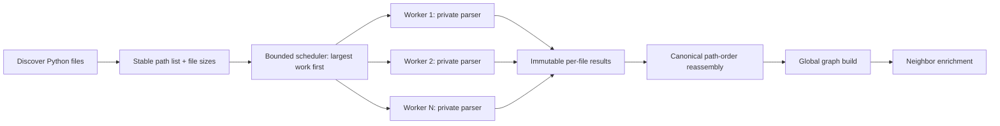

# RepoPilot Ingestion Parallelization — Codex Execution Prompt

This document contains a copy-paste-ready prompt for Codex to implement and verify bounded parallel repository chunking and efficient batched embedding in RepoPilot. Run the prompt from the repository root.

## Improved proposal for the chunking bottleneck

The proposed fix is a deterministic, bounded, file-parallel scan pipeline rather than naive parallel calls to `chunk_file()`. A Python file is the correct unit of work because parsing must establish complete AST boundaries before structural chunks can be emitted. Chunks from the same file should therefore stay together; independent files can be processed concurrently.

The target design has four stages:

1. **Discover:** walk the repository once, apply the existing directory exclusions, collect file size metadata, and create a stable list of repository-relative Python paths.
2. **Schedule:** distribute files across a bounded worker pool. Submit larger files first to reduce the long-tail effect where one very large module keeps the entire scan open after small files finish.
3. **Parse and chunk:** each worker owns its tree-sitter parser, reads one file, extracts symbols, creates structural chunks, and returns an immutable per-file result. Workers never mutate shared result lists or counters.
4. **Reassemble:** sort completed results back into canonical repository-relative path order, then construct the existing `modules`, `chunks`, and `loc_total` outputs. Graph construction remains a global barrier because it needs the complete symbol universe.



This is better than submitting files in alphabetical order because repository file sizes are usually skewed. Size-aware scheduling reduces worker idle time without changing output order. It is also safer than chunk-level parallelism: splitting one file before parsing would risk breaking AST boundaries, class/method relationships, line references, and module residue calculation.

### Proposed concurrency controls

- Add `ingestion_scan_workers`, defaulting conservatively to `min(8, max(1, os.cpu_count() or 1))` and validated as at least 1.
- Start with a `ThreadPoolExecutor` and thread-local tree-sitter parsers. This avoids transferring full source strings and chunk objects between processes.
- Keep a serial path when `ingestion_scan_workers=1`; use it as the correctness baseline and operational escape hatch.
- Bound in-flight work to a small multiple of the worker count rather than eagerly creating one future per repository file. This supplies backpressure for repositories with tens of thousands of files.
- Separate scheduling order from result order: schedule by descending estimated cost, reassemble by canonical path.
- Use file byte size as the initial cost estimate because it is available cheaply. Record actual duration and line count so later tuning can evaluate whether size is a good predictor.

### Proposed fallback and rollout strategy

1. Add stage telemetry and a serial-versus-parallel equivalence test first.
2. Introduce the worker abstraction while keeping one worker as the default in tests.
3. Enable bounded threaded scanning and compare outputs byte-for-byte at the `ModuleSource` and `Chunk` field level.
4. Benchmark worker counts `1, 2, 4, 8` on small, medium, and near-cap repositories.
5. Adopt the lowest worker count near the throughput plateau; do not assume the maximum is best.
6. Evaluate a process pool only if profiling proves the parse/chunk stage remains GIL-bound and process serialization cost is lower than the measured gain.

### Proposed success thresholds

- Zero differences in chunk identity, content, symbol, kind, line boundaries, or ordering between serial and parallel scans.
- At least a 1.5× median scan-stage speedup on a representative repository with enough files to amortize worker startup.
- No material regression for small repositories; use the serial path below a benchmark-derived file or byte threshold if parallel startup costs dominate.
- Bounded peak memory: the number of in-flight file results must be proportional to the worker count, not total repository file count.
- Clean failure semantics: a parse error identifies the repository-relative path, cancels remaining work, shuts down workers, and prevents partial persistence.
- No event-loop stalls from scan coordination.

Embedding and summarization optimizations remain part of the full proposal because total indexing latency will not improve sufficiently if chunk production becomes parallel while embedding remains one-vector-at-a-time.

## Copy-paste prompt

````text
You are a senior staff-level Python platform engineer specializing in high-throughput ingestion systems, asynchronous orchestration, deterministic data pipelines, profiling, and production-safe concurrency.

Work as an implementation owner, not as an advisor. Inspect the repository, make the required changes, add tests, run the relevant quality gates, benchmark or instrument the affected stages, update the Graphify knowledge graph when required, and report the verified outcome. Do not stop after proposing code or describing a plan.

## Objective

Reduce RepoPilot's indexing time for large public Python repositories by implementing:

1. Bounded parallel file discovery/parse/chunk processing.
2. True batched sentence-transformer embedding.
3. Safe overlap of independent summarization and embedding stages.
4. Bounded-memory orchestration and useful per-stage timing telemetry.

Preserve deterministic output, existing indexing semantics, cache correctness, graceful fallbacks, database integrity, and all public API contracts.

## Repository rules you must follow

- Read `AGENTS.md` first and treat it as authoritative.
- When `graphify-out/graph.json` exists, query Graphify before raw source searching:

  ```bash
  graphify query "How does repository ingestion flow through clone, parse, chunk, graph construction, summarization, embedding, and persistence?"
  graphify explain "index_repo()"
  graphify explain "embed_chunks()"
  ```

- Use Graphify to orient yourself, then inspect the exact source and tests involved.
- Preserve unrelated user changes in the worktree. Check `git status --short` before editing.
- Use Pydantic v2 conventions, strict typing, deterministic behavior, and the existing project logging style.
- Do not add a new agent tool. This work belongs inside the existing ingestion and provider layers.
- Do not commit or push unless explicitly asked.
- This is a multi-file architectural change. After implementation and verification, run `graphify update .`, inspect graph changes, and stage only `graphify-out/graph.json` and `graphify-out/manifest.json` if they changed, as required by `AGENTS.md`.

## Known current-state findings to verify

Do not blindly trust these statements; confirm them against the current checkout before editing.

- `packages/ingestion/src/repopilot_ingestion/pipeline.py::_scan_python_files` iterates through Python files and calls `parse_file()` and `chunk_file()` sequentially.
- `packages/ingestion/src/repopilot_ingestion/parse.py` has a module-global tree-sitter `Parser`, which must not be shared unsafely by concurrent workers.
- `packages/ingestion/src/repopilot_ingestion/embed.py::embed_chunks` creates a semaphore but awaits each chunk inside a sequential loop, so `ingestion_embed_concurrency` does not currently produce parallel work.
- `packages/core/src/repopilot_core/settings.py::Settings.ingestion_embed_batch_size` exists but is not used by the embedding execution path.
- The sentence-transformer adapter in `packages/core/src/repopilot_core/llm/provider.py` invokes `model.encode()` once per text under an encode lock. The encode call is synchronous and can block the event loop.
- `pipeline.py::index_repo` awaits summarization and embedding sequentially even though both consume the same enriched chunks and neither depends on the other's result.
- Persistence already batches vector inserts, but the complete index is intentionally committed transactionally.

## Approved chunking-bottleneck design

Implement file-parallel structural chunking with deterministic reassembly. Treat this as the preferred design unless profiling or a correctness constraint discovered in the current checkout provides concrete evidence against it.

The implementation must follow this algorithm:

1. Discover Python paths once and preserve the existing exclusions.
2. Record repository-relative path and byte size for each candidate.
3. Establish canonical output order by normalized repository-relative path.
4. Schedule larger files before smaller files to minimize the end-of-scan long tail.
5. Keep only a bounded number of jobs in flight, proportional to `ingestion_scan_workers`.
6. Give every worker an isolated tree-sitter parser.
7. Have each worker return one immutable `ScannedFile` result containing its `ModuleSource`, chunks, LOC, canonical order key, and useful timing metadata.
8. Aggregate only in the coordinator. Restore canonical path order before flattening chunks.
9. Stop at a global barrier before `build_graph()`, which requires the complete module set.
10. On failure, include the relative path, cancel outstanding work, close the executor, and persist nothing.

Do not split an individual file into arbitrary byte or line ranges. Structural chunks depend on complete AST nodes, and naive intra-file splitting can corrupt decorators, multiline signatures, classes, methods, docstrings, and module residue. A very large individual file may still be parsed as one work item. If real profiling later proves single-file skew is material, propose a separate AST-aware second-level design rather than adding unsafe textual splitting.

Use scheduling order only to improve utilization; never allow it to change persisted order. If two files have the same estimated cost, use canonical relative path as the tie-breaker.

Add an adaptive bypass for small inputs only if benchmarks justify it. The threshold must be configurable or derived from measured file count/total bytes, covered by tests, and logged. Avoid unexplained magic numbers.

## Required implementation

### A. Add bounded parallel parse and chunk processing

Refactor scanning around a typed, top-level, independently testable worker result. A suitable shape is:

```python
@dataclass(frozen=True, slots=True)
class ScannedFile:
    module_source: ModuleSource
    chunks: list[Chunk]
    line_count: int
```

Implement a worker that receives the repository root and one Python path, derives the repository-relative path and dotted module name, parses the file, chunks it, and returns all per-file output without mutating shared collections.

Requirements:

- Materialize and sort discovered paths before dispatch so output is deterministic across runs.
- Retain a canonical path-order key, then schedule by descending file size with canonical path as the tie-breaker. Restore canonical order before returning results.
- Use bounded concurrency controlled by a new validated setting such as `ingestion_scan_workers`.
- Choose a conservative default derived from available CPUs and capped at a small number such as 8. Allow an environment override.
- Prefer a thread pool initially because it avoids serializing complete source strings and chunk objects between processes. Make the tree-sitter parser thread-local or instantiate it per worker so no parser instance is used concurrently.
- Keep result aggregation in stable path order.
- Do not mutate shared `modules`, `chunks`, or LOC counters inside workers.
- Ensure worker exceptions identify the failing repository-relative path and propagate cleanly; do not silently skip source files.
- Avoid blocking the main asyncio event loop while coordinating synchronous scan work. Use an appropriate executor boundary.
- Bound pending futures or queue capacity to a small multiple of worker count; do not submit tens of thousands of files eagerly.
- Shut down executors deterministically on success, failure, or cancellation.
- Keep `_iter_python_files()` exclusion behavior unless tests demonstrate a bug. Add tests for deterministic ordering and skipped directories.
- Do not parallelize graph construction prematurely. It is a global two-pass operation that needs all module definitions; profile it separately.

If measurement shows threads cannot improve this stage because Python work dominates and tree-sitter does not release enough execution time, document the evidence and switch to a bounded process pool only if the serialization and worker-startup costs are justified. Do not choose processes by intuition alone.

### B. Implement true batch embedding

This is expected to provide the largest speedup. Do not merely replace a loop with `asyncio.gather()`.

Add a typed batch API at the provider boundary, for example:

```python
async def embed_many(
    self,
    texts: Sequence[str],
    *,
    model: ModelId = ModelId.EMBEDDINGS,
    batch_size: int,
) -> list[EmbeddingResponse]:
    ...
```

Requirements:

- Preserve the existing `embed()` API for current callers. It may delegate to `embed_many()` with one item if that does not introduce recursion or unnecessary overhead.
- Compute the existing canonical per-text cache key for every input.
- Fetch cached embeddings and batch only cache misses.
- Handle duplicate texts without encoding them repeatedly.
- Call sentence-transformers with a sequence of texts and the configured `ingestion_embed_batch_size`:

  ```python
  model.encode(
      texts,
      batch_size=batch_size,
      normalize_embeddings=True,
      convert_to_numpy=True,
  )
  ```

- Run the synchronous encode operation off the asyncio event loop, normally with `asyncio.to_thread()`.
- Retain safe model lazy-loading. Ensure concurrent calls cannot load the model multiple times.
- Define the locking boundary carefully. Multiple calls must not concurrently use a model if the chosen backend is not thread-safe, but a single batch must contain many texts.
- Return one response per input in the exact original order, including cached items and duplicates.
- Store newly produced vectors under the same per-text cache keys used by `embed()`.
- Validate that the number and dimensionality of returned vectors match expectations. Raise or use the existing deterministic fallback according to current failure semantics.
- Use `ingestion_embed_batch_size`; validate it is at least 1.
- Reassess `ingestion_embed_concurrency`. Local sentence-transformer throughput normally comes from internal tensor batching rather than multiple simultaneous `encode()` calls. Remove misleading concurrency machinery or clearly redefine the setting based on measured behavior. Preserve backward compatibility where reasonable.
- Update docstrings and comments that currently claim behavior the code does not provide.

Update `embed_chunks()` to build embedding texts once, invoke the batch provider, pair vectors with chunks in stable order, and preserve the deterministic fallback behavior when the provider rejects a batch. If a batch fails, use a bounded split or per-item fallback strategy so one pathological chunk does not force fallback vectors for every otherwise-valid chunk.

### C. Overlap summarization and embedding safely

After chunks have been enriched with graph neighbors, run summarization and embedding with `asyncio.gather()` because they are independent:

```python
summarised, embedded = await asyncio.gather(
    summarise_chunks(chunks, provider=provider, settings=settings),
    embed_chunks(chunks, provider=provider, settings=settings),
)
```

Requirements:

- Confirm `LLMProvider`, its cache, and underlying clients support these two operations concurrently.
- Because local embedding is CPU/GPU work, ensure it does not block summary HTTP progress.
- Preserve cancellation and exception propagation. Do not leave orphan tasks after one branch fails.
- Preserve summary circuit-breaker behavior and embedding fallback behavior.

### D. Bound summary scheduling memory

The summary path currently may construct one coroutine per chunk. Replace this with a bounded worker-queue or bounded batch orchestration if a large repository can create thousands of chunks.

Requirements:

- Start only `ingestion_summary_concurrency` workers.
- Store each result at its original index so result order matches input order.
- Preserve the current circuit breaker: after the first provider failure, remaining work should cheaply resolve to `"unknown"` rather than continuing to stampede providers.
- Make cancellation shut down workers cleanly.
- Do not introduce unbounded queues of active tasks.

### E. Add per-stage observability

Instrument the pipeline using the existing `structlog` conventions and a monotonic clock.

At minimum, emit elapsed duration and relevant counts for:

- clone
- file discovery
- parse/chunk scan
- graph construction
- neighbor enrichment
- summarization
- embedding
- persistence
- total indexing

Include useful fields where applicable: repository URL or ID, file count, LOC, chunk count, graph node/edge count, scan worker count, embedding batch size, cache hit/miss counts when available, and elapsed milliseconds.

Do not log source contents, credentials, connection strings, model tokens, or other secrets.

## Tests you must add or update

Add focused unit tests before relying on slow integration tests.

### Parallel scanning tests

- Serial-worker and multi-worker scans return equivalent modules, chunks, LOC, and ordering.
- Repeated parallel runs produce identical ordered results.
- Excluded directories remain excluded.
- A worker failure reports the repository-relative file path.
- The tree-sitter parser is safe under simultaneous file parsing.
- `ingestion_scan_workers=1` remains a deterministic fallback.
- Size-aware scheduling does not affect canonical output ordering.
- The number of concurrently pending work items remains bounded for a generated large-file-count fixture.
- A repository dominated by one large file remains correct and produces telemetry that exposes the skew.

### Batch embedding tests

- Several uncached texts produce one or the expected minimum number of batch encode calls.
- Batch size is passed to sentence-transformers.
- Cached inputs are not encoded again.
- Mixed cache hits and misses preserve input order.
- Duplicate input text is encoded only once while producing duplicate ordered responses.
- Empty input returns an empty list without loading the model.
- Existing single-text `embed()` behavior remains compatible.
- Model encoding runs off the event-loop thread.
- Dimension/count mismatches fail safely.
- A failing or oversized chunk does not force unrelated chunks to use fallback vectors.

### Pipeline orchestration tests

- Summarization and embedding demonstrably overlap using controlled async fakes/events rather than timing-only sleeps.
- Cancellation and failure do not leak tasks or executors.
- Existing `PipelineResult`, persistence keys, and result counts remain unchanged.
- Stage timing events contain the expected fields without sensitive content.

Avoid flaky tests that assert small wall-clock differences. Use barriers, events, recording fakes, and deterministic call counters to prove concurrency.

## Verification commands

Discover the repository's actual environment and command conventions first. Run the narrowest relevant checks, then the wider ingestion/core suite. At minimum, aim to run equivalents of:

```bash
pytest packages/ingestion/tests -q
pytest packages/core/tests -q
ruff check packages/ingestion packages/core apps/api
mypy --strict packages/ingestion/src packages/core/src
```

If the monorepo exposes commands through `uv`, Poetry, Make, or another wrapper, use the canonical project commands instead of inventing alternatives.

Run the existing slow indexing benchmark only when its external requirements are available:

```bash
pytest packages/ingestion/tests/test_httpx_indexing.py::test_indexing_under_90s -m "slow and integration" -q
```

If live services, credentials, model weights, Postgres, or network access make the integration benchmark unavailable, do not fake a pass. Report exactly what was not run and provide a reproducible command for the user.

## Performance validation

Create or use a deterministic local benchmark that separates stage timings. Compare the same checkout and repository corpus before and after the change.

Report:

- Test repository or generated corpus characteristics.
- Python file count, LOC, and chunk count.
- Hardware/worker/batch configuration.
- Scan duration before and after.
- Scan throughput and worker utilization for worker counts `1, 2, 4, 8` where the environment permits.
- Embedding duration before and after.
- Total indexing duration before and after when live dependencies are available.
- Median of multiple warm runs, plus whether model download and cold cache were excluded.
- Any throughput, memory, rate-limit, or determinism trade-offs.

Do not claim a speedup from code inspection alone. If a full before/after benchmark is unavailable, label the expected improvement as unverified.

## Acceptance criteria

The task is complete only when all applicable criteria are satisfied:

1. Parsing and chunking use bounded configurable workers.
2. The tree-sitter parser is not unsafely shared across threads.
3. Scanning results remain deterministic and semantically equivalent.
4. Work scheduling is size-aware while returned modules and chunks remain in canonical path order.
5. In-flight scanning work is bounded relative to worker count.
6. Failures cancel outstanding work and cannot cause partial persistence.
7. `ingestion_embed_batch_size` controls actual sentence-transformer batching.
8. Embedding no longer invokes `model.encode()` once per uncached chunk.
9. Synchronous model encoding no longer blocks the asyncio event loop.
10. Cache hits, misses, duplicates, and output ordering are correct.
11. Summarization and embedding overlap safely.
12. Summary task creation is bounded for large repositories.
13. Pipeline stages expose trustworthy duration and count telemetry.
14. Relevant tests, Ruff, and strict mypy pass.
15. Existing database and API contracts remain unchanged unless a necessary migration is explicitly justified and tested.
16. Graphify is updated and graph artifacts are staged if changed.

## Engineering guardrails

- Prefer small typed helpers over a single large orchestration function.
- Preserve raw chunk content and enriched-text behavior.
- Do not alter chunk boundaries, symbols, line references, adjacency semantics, or persisted identity keys as a side effect of concurrency work.
- Avoid shared mutable state inside workers.
- Avoid unbounded `asyncio.gather()` over repository-sized collections.
- Do not tune defaults so aggressively that local development machines or CI runners become unstable.
- Do not swallow cancellation (`asyncio.CancelledError`).
- Do not add dependencies unless the standard library and existing packages cannot satisfy a clearly documented requirement.
- Update relevant architecture or startup documentation when configuration or operational behavior changes.

## Required final response

Lead with the implemented result. Include:

1. What changed, grouped by scan concurrency, batch embedding, orchestration, and telemetry.
2. Exact files changed with useful line references.
3. Tests and checks run, with pass/fail counts.
4. Measured benchmark results or a precise statement that they remain unverified.
5. Any operational tuning guidance for worker count and embedding batch size.
6. Remaining risks or follow-up work.
7. The exact `GRAPH STATUS` block required by `AGENTS.md`.

Do not claim completion if required tests fail, graph maintenance fails, or correctness is only assumed.
````

## Suggested use

Start Codex from the RepoPilot repository root, paste the prompt above, and let it inspect the current checkout before editing. The prompt intentionally requires Codex to verify the stated bottlenecks because implementation details may evolve after this document is written.
